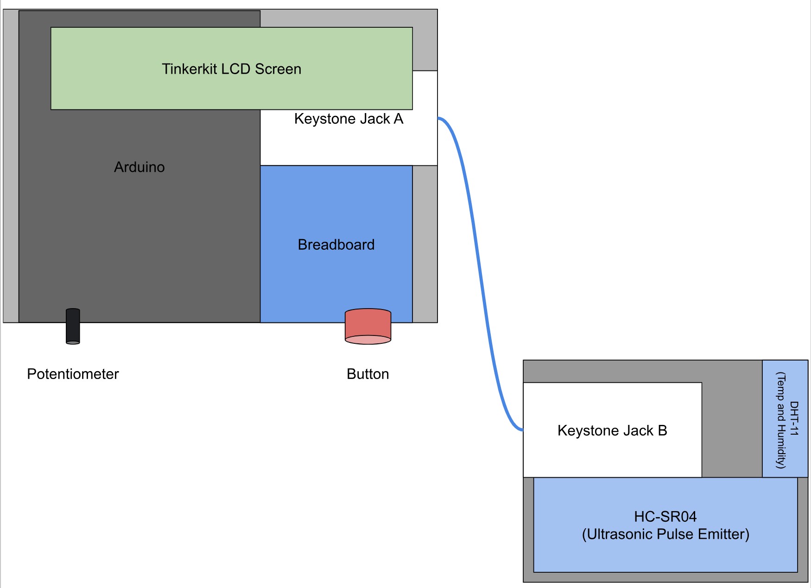
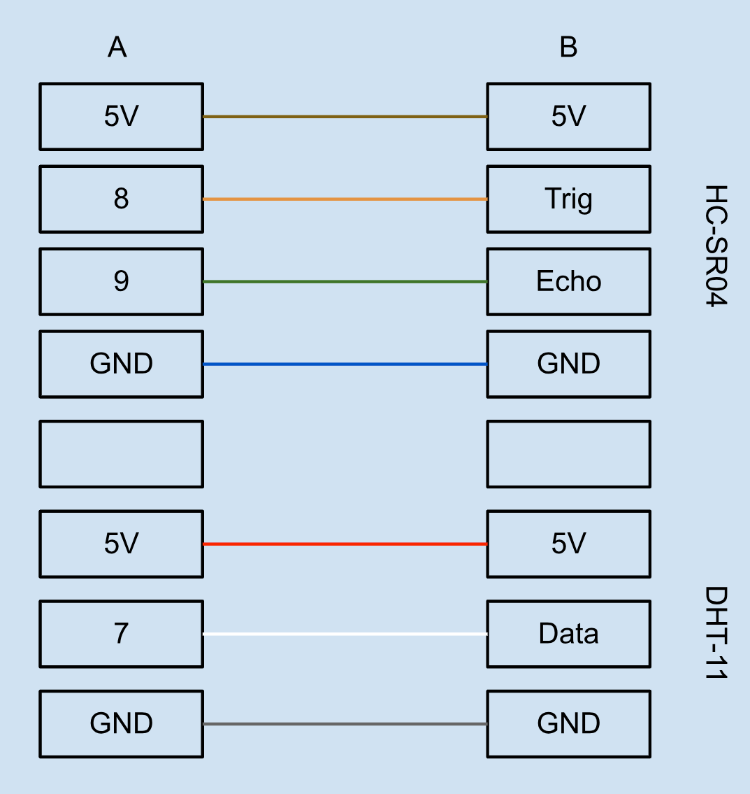

# RDM_DropTest
*By Ishaan Banwait with mentorship from Arash Jenab, PhD, P.Eng., PMP*

*August 31, 2023*

An Arduino-based monitoring system that enhances product quality assurance by tracking durability metrics of a passenger assist strap on a drop test machine.

### Libraries
- Adafruit Unified Sensor 1.1.12
- DHT sensor library 1.4.4
- DHT Sensors Non-Blocking 1.0.3
- DHT11 1.0.0
- DHTlib 0.1.35
- SD 1.2.4
- Tinkerkit Library 0.1
- TKLCD 

### Hardware Diagram

### Keystone Jack Configuration

### Arduino Pin Allocation
| Pin on Arduino | Purpose |
| --- | ----------- |
| 4 | SD Card Shield |
| 11 | SD Card Shield |
| 12 | SD Card Shield |
| 13 | SD Card Shield |
| A0 | LCD RS |
| A1 | LCD Enable |
| A2 | LCD D4 |
| A3 | LCD D5 |
| A4 | LCD D6 |
| A5 | LCD D7 |
| 6 | Button Signal |
| 7 | DHT-11 Data |
| 8 | HC-SR04 Trig |
| 9 | HC-SR04 Echo |

### Resistor Locations
- 10k Ω resistor from button to ground
- 220 Ω resistor from LCD + to 5V
